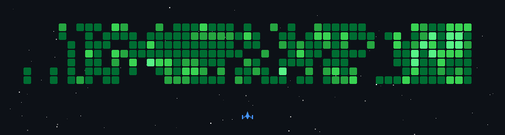

  

  <a href="https://github.com/FellipeVoid?tab=repositories"><b>Projects</b></a>
  &nbsp;·&nbsp;
  <a href="https://www.gitskins.com">GitSkins</a>
  &nbsp;·&nbsp;
  <a href="mailto:delltorof2@gmail.com">Contact</a>

  

## Junior backend dev learning by building

I'm a junior backend developer working with Python and Java, currently diving into machine learning. I'm also a technical artist, so I split my time between writing code and building things in Blender, Unreal Engine, and ZBrush.

Still early in the journey — most of what's here is me learning in public and figuring things out project by project.

  <picture>
    <source media="(prefers-color-scheme: light)" srcset="https://www.gitskins.com/api/section/about?username=FellipeVoid&theme=github-dark&mode=light" />
    
  </picture>

## Projects I'm building

  

  

  

## Just a little extra

Nothing serious here, just a ship sweeping the contribution grid for fun — rebuilt daily from my real activity in this repo.

  

## What I'm learning right now

  

  <a href="https://github.com/FellipeVoid?tab=repositories">See all repositories</a>
  &nbsp;·&nbsp;
  <a href="https://www.gitskins.com/readme-generator">Build a profile like this</a>

  Designed with GitSkins.

